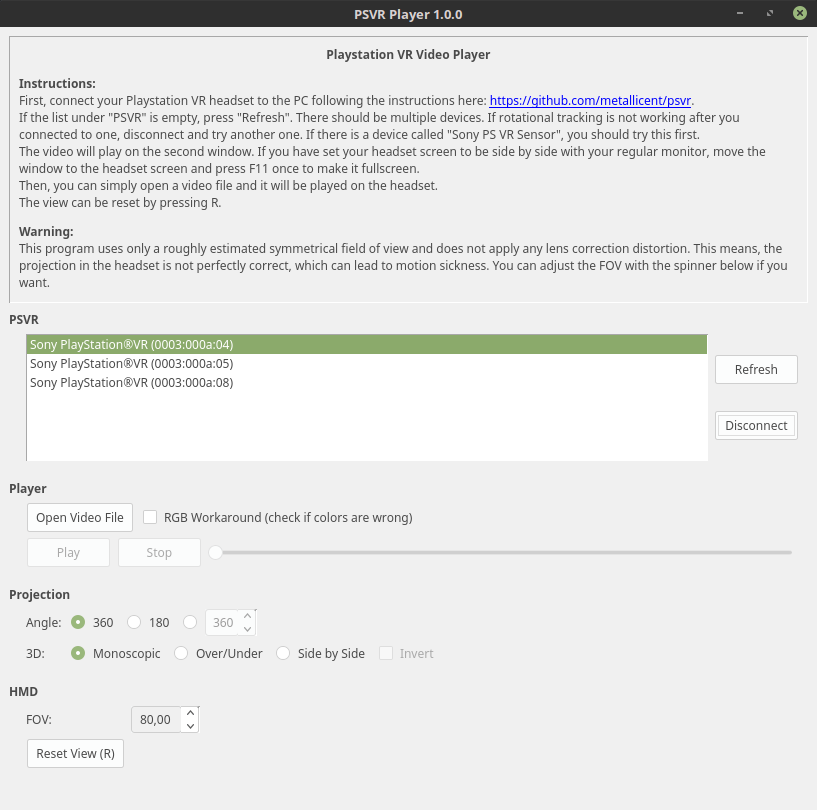

# PSVR Player
**Disclaimer:** This project is not endorsed or certified by Sony Interactive Entertainment LLC.

This is a cross-platform 3D 360/180 video player for the Playstation VR headset. It uses libvlc to stream videos to OpenGL in order to display them on the headset. For rotational tracking, it reads the data from the HID device using hidapi. A GUI is provided using Qt 5. It has been tested on Windows and Linux so far.

This project has been made possible after emoRaivis found out how to get the tracking data from PSVR and developed the app MacMorpheus, which is essentially the same as this project, but as an exclusive Mac application. It is available here: https://github.com/emoRaivis/MacMorpheus. A big thanks to him!

### Warning
This program uses only a roughly estimated symmetrical field of view and does not apply any lens correction distortion. This means, the projection in the headset is not perfectly correct, which can lead to motion sickness.

## Screenshot

## Download
Windows binaries are provided here: https://github.com/metallicent/psvr/releases

For Linux, you will have to compile the program yourself for now.

## Setup
emoRaivis has made a nice wiring diagram with instructions on how to set up PSVR for the PC: https://github.com/emoRaivis/MacMorpheus

## Supported Formats
Since libvlc is used, a huge variety of file formats and codecs is supported.

An arbitary projection angle can be used in combination with one of these modes:
* Monoscopic
* 3D Over/Under
* 3D Side by Side

## TODO / Known Issues
* Find out / measure accurate values for the asymmetrical FOV of the HMD and apply correct barrel distortion.
* libvlc outputs the frame data as BGR instead of RGB on different systems. A checkbox has been added as a temporary workaround to switch between both modes.
* Audio seems to stop working when stopping the video on Windows 10.

## About
Created by Florian Märkl: https://www.metallic-entertainment.com

This program is free software: you can redistribute it and/or modify
it under the terms of the GNU General Public License as published by
the Free Software Foundation, either version 3 of the License, or
(at your option) any later version.

This program is distributed in the hope that it will be useful,
but WITHOUT ANY WARRANTY; without even the implied warranty of
MERCHANTABILITY or FITNESS FOR A PARTICULAR PURPOSE. See the
GNU General Public License for more details.

You should have received a copy of the GNU General Public License
along with this program. If not, see http://www.gnu.org/licenses/.
